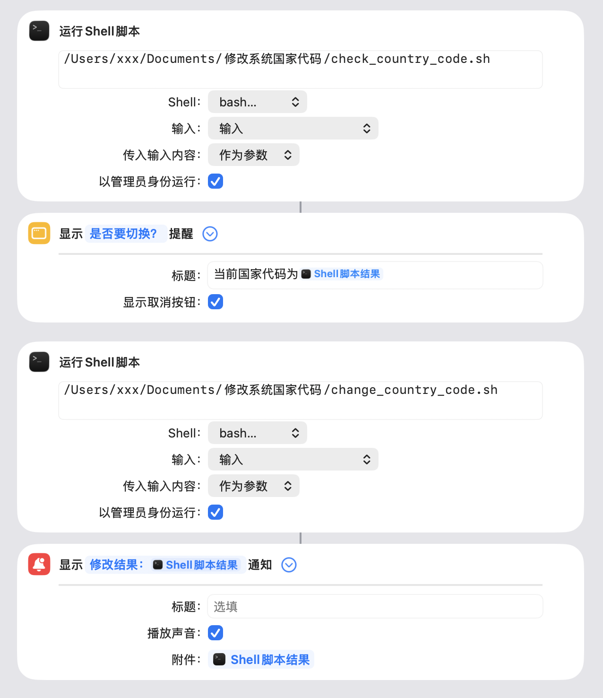

## ⚠️ 重要前提条件
***关闭SIP才能实现以下所有功能***

## 🚀 快速开始（推荐方案：快捷指令）

这是最方便、最直观的使用方式，无需打开终端，可以搭配菜单栏或快捷键快速调用。

### 前置步骤：配置 Touch ID 进行 sudo 认证（强烈推荐，如果担心可以跳过）

为了极致体验，我们强烈建议你启用 Touch ID 来执行 sudo 命令，这样在需要权限时按指纹即可，无需输入密码。

1.  打开**终端** (Terminal)。
2.  输入以下命令来编辑认证配置文件：
    ```bash
    sudo nano /etc/pam.d/sudo
    ```
3.  在文件**第一行**插入以下内容：
    ```
    auth       sufficient     pam_tid.so
    ```
4.  按下 `Control + X`，然后输入 `Y` 确认保存，最后按回车退出。
5.  **完全关闭终端应用后重新打开**，此后执行 sudo 命令就会触发 Touch ID 验证。

### 安装与使用

1.  **下载脚本文件**
    将本项目中的 `check_country_code.sh` 和 `change_country_code.sh` 两个文件下载到你的用户目录 (`~`) 下。

2.  **修改行号**
    编辑`check_country_code.sh`，把文件中的**101**全部替换为你的`/private/var/db/com.apple.countryd/countryCodeCache.plist`文件中写出US或者CN的行号，参考下面的 ⚠️ ***重要注意事项***

3.  **赋予执行权限**
    打开**终端**，执行以下命令：
    ```bash
    chmod +x ~/check_country_code.sh ~/change_country_code.sh
    ```

4.  **导入并配置快捷指令**
    *   打开 macOS **快捷指令** App。
    *   点击菜单栏的`文件` > `导入...`，选择本项目提供的 `.shortcut` 文件。
    *   导入后，**你需要手动修改快捷指令中的两个 Shell 脚本操作**，确保其路径指向你刚才存放脚本的位置（通常是 `/Users/你的用户名/check_country_code.sh`）。

    

5.  **运行**
    *   在快捷指令 App 中直接点击运行。
    *   或将快捷指令添加到**菜单栏**或**程序坞**，以便随时访问。
    *   运行时，它会先显示当前配置，询问你是否切换。点击`取消`则退出，点击`确定`则会触发一次指纹验证并进行修改。

---

## 🖱️ 方案二：双击运行脚本

如果你更喜欢传统的脚本方式，这个方案适合你。

1.  **下载文件**
    下载 `修改系统国家代码_双击运行.command` 文件到你的桌面。

2.  **赋予执行权限**
    打开**终端**，输入以下命令：
    ```bash
    chmod +x ~/Desktop/修改系统国家代码_双击运行.command
    ```

3.  **运行**
    **直接双击桌面上的脚本文件**即可运行。首次运行时，系统可能会提示“无法打开，因为无法验证开发者”。请前往`系统设置` > `隐私与安全性`，在下方点击`仍要打开`。

4.  **如何工作**
    该脚本会在终端中运行，自动检测当前配置并**立即执行切换操作**。它会请求一次管理员权限（密码或指纹），并在操作完成后通过通知告知结果。

---

## ⚙️ 方案三：自动操作 (Automator)

此方案适合希望与系统深度集成的用户。

1.  **打开自动操作 App**，新建一个**快速操作**。
2.  设置`工作流程收到当前`为`没有输入`。
3.  在左侧操作库中，添加一个`运行 Shell 脚本`操作。
4.  将 `修改系统国家代码_自动操作.sh` 文件中的全部内容复制粘贴到 Shell 脚本输入框中。
5.  保存该快速操作（例如命名为`切换国家代码`）。
6.  你可以在`系统设置` > `键盘` > `快捷键` > `服务`中为该操作设置一个**全局快捷键**。

---

## ⚠️ 重要注意事项

*   **行号可能不同**: 本工具的脚本默认修改 `/private/var/db/com.apple.countryd/countryCodeCache.plist` 文件的**第 101 行**。根据 macOS 版本不同，此位置**可能发生变化**。使用前建议使用以下命令确认：
    ```bash
    sudo chflags nouchg /private/var/db/com.apple.countryd/countryCodeCache.plist
    nano /private/var/db/com.apple.countryd/countryCodeCache.plist
    ```
    （使用 `Control + W` 然后输入 `CN` 或 `US` 来搜索确认所在行号，查看后记得运行 `sudo chflags uchg ...` 重新锁定文件。）
*   大概会写为`<string>US</string>`或者`<string>CN</string>`

*   **日志与备份**: 工具的所有操作都会记录到 `~/Library/Logs/CountryCodeModifier.log` 文件。在修改前会自动备份原文件至相同目录下的 `.backup` 文件。如果出现意外，你可以从备份中恢复。

*   **系统兼容性**: 本项目在 macOS 26 上开发和测试，理论上支持之后的版本，但不保证绝对兼容。

---

## 🤝 贡献

如果你有好的想法或发现了问题，欢迎提交 Issue 或 Pull Request！

## ⭐ 如果这个项目帮到了你

请给它点个 Star！这是对开发者最大的鼓励。
